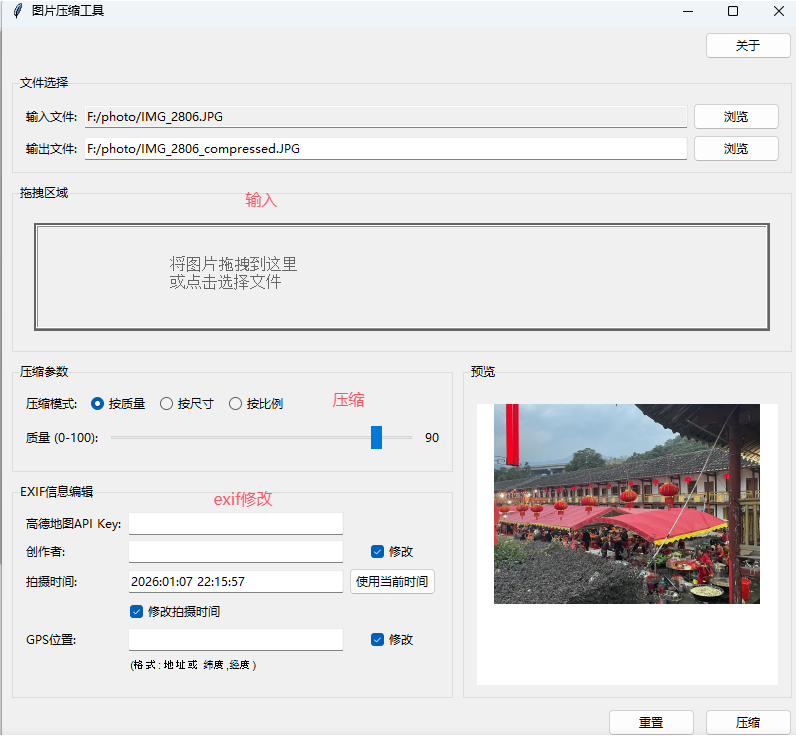
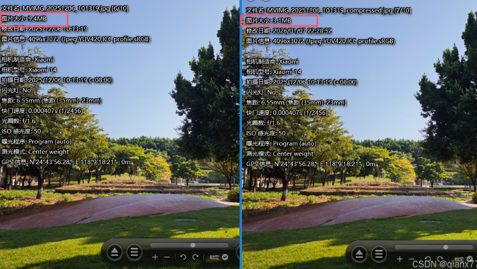
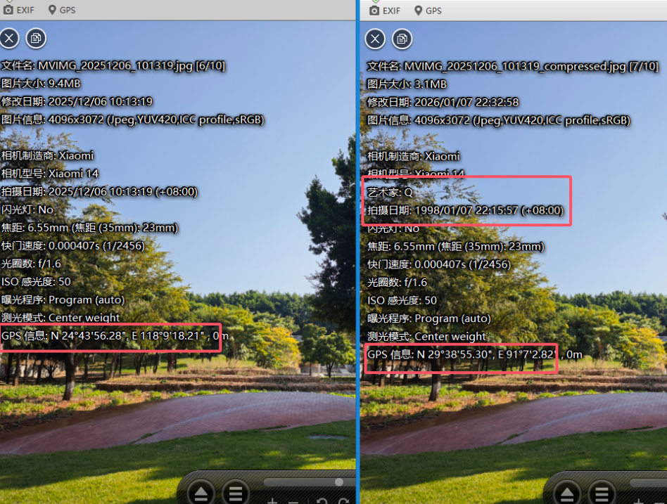

# 图片压缩工具 v1.0
## 功能
- 图片压缩（质量、尺寸、比例三种模式），推荐直接按照质量压缩
- EXIF信息编辑（创作者、拍摄时间、GPS位置）
- 高德地图API地址转经纬度
- 拖拽文件支持
- 剪贴板支持    
## 界面 

## 输入
有三种方式
1、浏览文件夹选择图像
2、截图（不管你用QQ截图还是系统截图）截图后直接CTRL+V粘贴到输入文件夹那栏就行
3、可以直接把图像拉到拖拽区域
## 压缩方式
三种方案
1、按照质量，可以解释为JPEG压缩等级，100%为没压缩
2、按照尺寸，可以输入目标图像尺寸，默认固定长宽比，用小的比例进行resize
3、按照比例，就是resize成小图，因为手机拍的照片都很大 4k*3k，实际不需要这么大像素
## EXIF信息修改
目前支持修改三种数据
1、创作者，可以图片信息加上自己的名字
2、拍摄时间，有的图片经过微信传输啥的，时间就改变了，可以增加时间信息
3、GPS位置修改，有的图片可能发出来怕隐私泄露，但是又不想完全没有位置信息，可以加上这个，通过地址就可以转成图片经纬度信息，自己附着在图片上。但是需要注意的是，这个需要自己申请下高德地图的api key（有免费额度，一般用不完）。
## 演示
### 手机图片压缩
小米手机的图像，按照90%质量压缩，基本无损，肉眼分辨不出来，但是大小缩小60%+

### exif信息修改

